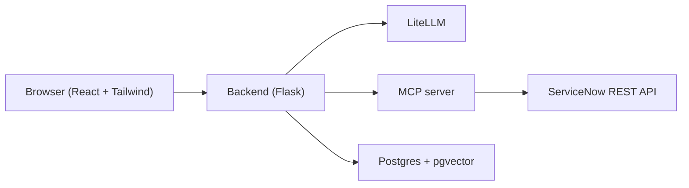

# InstanceMate

InstanceMate is an AI troubleshooting assistant for ServiceNow. Users log in with their own ServiceNow instance (OAuth or basic auth), pick an LLM provider (OpenAI, Anthropic, or Google — bring your own key), and an agent queries the live instance over REST through an MCP server to help diagnose issues. Answers users mark as helpful are embedded into a pgvector-backed knowledge base to improve future troubleshooting.

## Architecture



## Planned stack

- **Backend**: Python, Flask
- **LLM routing**: LiteLLM (OpenAI / Anthropic / Google, BYOK)
- **Tooling**: MCP server (Python) exposing ServiceNow REST operations
- **Data**: Postgres + pgvector for the knowledge base, local embedding model
- **Frontend**: React + Tailwind CSS
- **Deployment**: single VPS (details TBD)

## Repo layout

```
backend/      Flask backend
mcp-server/   MCP server exposing ServiceNow tools
frontend/     React + Tailwind frontend
infra/        Deployment / infrastructure config
docs/         Additional documentation
```

## Getting started

TBD

## Contributing

See [CONTRIBUTING.md](CONTRIBUTING.md).

## Security

See [SECURITY.md](SECURITY.md).

## License

[GNU GPL v3.0](LICENSE)
