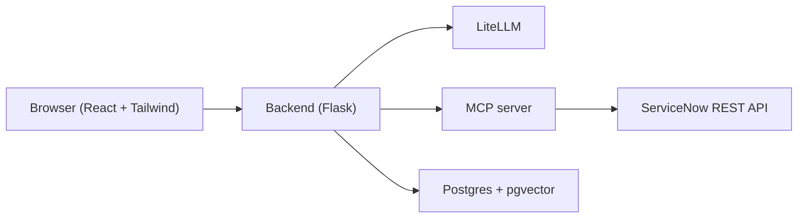

# InstanceMate

InstanceMate is an AI troubleshooting assistant for ServiceNow. Users log in with their own ServiceNow instance (OAuth or basic auth), pick an LLM provider (OpenAI, Anthropic, or Google — bring your own key), and an agent queries the live instance over REST through an MCP server to help diagnose issues. Answers users mark as helpful are embedded into a pgvector-backed knowledge base to improve future troubleshooting.

## Architecture


```mermaid
flowchart LR
    Browser["Browser (React + Tailwind)"]
    Backend["Backend (Flask)"]
    LiteLLM["LiteLLM"]
    MCP["MCP server"]
    SN["ServiceNow REST API"]
    PG["Postgres + pgvector"]

    Browser --> Backend
    Backend --> LiteLLM
    Backend --> MCP
    MCP --> SN
    Backend --> PG
```

## Planned stack

- **Backend**: Python, Flask
- **LLM routing**: LiteLLM (OpenAI / Anthropic / Google, BYOK)
- **Tooling**: MCP server (Python) exposing ServiceNow REST operations
- **Data**: Postgres + pgvector for the knowledge base, local embedding model
- **Frontend**: React + Tailwind CSS
- **Deployment**: single VPS (details TBD)

## Why LiteLLM

InstanceMate is BYOK across three LLM providers (OpenAI, Anthropic, Google), each with its own SDK, message format, and set of exceptions. [LiteLLM](https://github.com/BerriAI/litellm) gives the backend one consistent function — `litellm.completion(model=..., messages=..., api_key=...)` — that works the same way regardless of provider: pass a different `model` string and LiteLLM translates the request/response and normalizes errors into one shared exception type. That means the backend's chat logic is written once and stays provider-agnostic instead of branching per provider everywhere it talks to an LLM; `backend/app/services/llm_client.py` is the thin wrapper around it.

## Repo layout

```
backend/      Flask backend
mcp-server/   MCP server exposing ServiceNow tools
frontend/     React + Tailwind frontend
infra/        Deployment / infrastructure config
docs/         Additional documentation
```

## Getting started

Prerequisites: Python 3.12+ and Node.js 20+ (with npm).

One env file for the whole project, in the repo root:

```bash
cp .env.example .env   # fill in values you need locally
```

Backend, frontend, and mcp-server all read this same root `.env` (Flask/python-dotenv and the MCP server search upward for it automatically; the frontend is pointed at it via `envDir` in `vite.config.ts`) - no per-service copies needed.

`.env` only holds infrastructure config (database, session secret, app URLs). It does **not** hold ServiceNow credentials or LLM API keys — those are per-user: once you've registered an account and logged in (see below), add a ServiceNow instance and an AI provider from the **Settings** page in the app itself. Each is encrypted and stored per-user in the database, not read from the environment.

### Backend (Flask)

```bash
cd backend
python3 -m venv venv               # create an isolated Python environment
source venv/bin/activate           # activate it (Windows: venv\Scripts\activate)
pip install -r requirements.txt    # install Flask + dev/test tooling
flask db upgrade                   # create/update DB tables (SQLite file by default)
flask run                          # start the dev server at http://127.0.0.1:5000
```

Check it's up with `curl http://127.0.0.1:5000/health`. `flask db upgrade` is needed before using account/login features (it creates the tables), but the server itself boots fine without it. Other useful commands from `backend/`: `pytest` (run tests) and `ruff check .` (lint).

For real Postgres locally, uncomment `DATABASE_URL` in `.env` (built from the `POSTGRES_*` values above it) and, from the repo root:

```bash
docker compose --env-file .env -f infra/docker-compose.yml up -d
```

The `--env-file .env` is required — Compose otherwise looks for a `.env` next to the compose file, not at the path you point `-f` from, and would silently start Postgres with the file's hardcoded fallback values instead of yours.

### Frontend (Vite + React + Tailwind)

```bash
cd frontend
npm install     # install dependencies
npm run dev     # start the dev server at http://localhost:5173
```

Other useful commands from `frontend/`: `npm run build` (production build), `npm run lint` (ESLint), `npm run format` (Prettier, writes changes).

### MCP server

```bash
cd mcp-server
python3 -m venv venv               # create an isolated Python environment
source venv/bin/activate           # activate it (Windows: venv\Scripts\activate)
pip install -r requirements.txt    # install the MCP SDK + dev/test tooling
python run.py                      # start the server at http://127.0.0.1:8001/mcp
```

Only exposes a trivial `ping` tool for now (proves the wiring); real ServiceNow tools land in follow-up issues. Other useful commands from `mcp-server/`: `pytest` (run tests) and `ruff check .` (lint).

### Using the app

With the backend and frontend running, open `http://localhost:5173`, register an account, then go to **Settings** to connect a ServiceNow instance (OAuth or basic auth) and add an AI provider profile (OpenAI, Anthropic, or Google + your API key).

## Contributing

See [CONTRIBUTING.md](CONTRIBUTING.md).

## Security

See [SECURITY.md](SECURITY.md).

## License

[GNU GPL v3.0](LICENSE)
