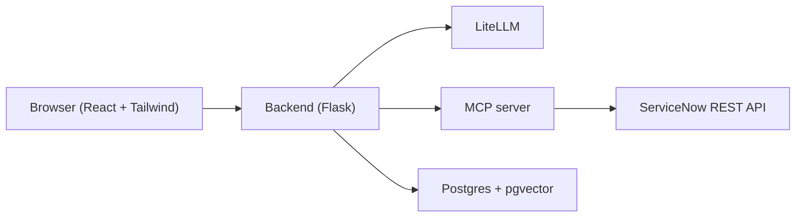

# InstanceMate

InstanceMate is an AI troubleshooting assistant for ServiceNow. Users log in with their own ServiceNow instance (OAuth or basic auth), pick an LLM provider (OpenAI, Anthropic, or Google — bring your own key), and an agent queries the live instance over REST through an MCP server to help diagnose issues. Answers users mark as helpful are embedded into a pgvector-backed knowledge base to improve future troubleshooting.

## Architecture


```mermaid
flowchart LR
    Browser["Browser (React + Tailwind)"]
    Backend["Backend (Flask)"]
    LiteLLM["LiteLLM"]
    MCP["MCP server"]
    SN["ServiceNow REST API"]
    PG["Postgres + pgvector"]

    Browser --> Backend
    Backend --> LiteLLM
    Backend --> MCP
    MCP --> SN
    Backend --> PG
```

## Planned stack

- **Backend**: Python, Flask
- **LLM routing**: LiteLLM (OpenAI / Anthropic / Google, BYOK)
- **Tooling**: MCP server (Python) exposing ServiceNow REST operations
- **Data**: Postgres + pgvector for the knowledge base, local embedding model
- **Frontend**: React + Tailwind CSS
- **Deployment**: single VPS (details TBD)

## Repo layout

```
backend/      Flask backend
mcp-server/   MCP server exposing ServiceNow tools
frontend/     React + Tailwind frontend
infra/        Deployment / infrastructure config
docs/         Additional documentation
```

## Getting started

Prerequisites: Python 3.12+ and Node.js 20+ (with npm).

### Backend (Flask)

```bash
cd backend
python3 -m venv venv               # create an isolated Python environment
source venv/bin/activate           # activate it (Windows: venv\Scripts\activate)
pip install -r requirements.txt    # install Flask + dev/test tooling
cp ../.env.example .env            # copy env template, fill in values you need locally
flask run                          # start the dev server at http://127.0.0.1:5000
```

Check it's up with `curl http://127.0.0.1:5000/health`. Other useful commands from `backend/`: `pytest` (run tests), `ruff check .` (lint), and `flask db upgrade` (apply DB migrations - not required to start, since `DATABASE_URL` falls back to a local SQLite file if you skip the `.env` copy above). For real Postgres locally: `docker compose -f infra/docker-compose.yml up -d`.

### Frontend (Vite + React + Tailwind)

```bash
cd frontend
npm install     # install dependencies
npm run dev     # start the dev server at http://localhost:5173
```

Other useful commands from `frontend/`: `npm run build` (production build), `npm run lint` (ESLint), `npm run format` (Prettier, writes changes).

### MCP server

```bash
cd mcp-server
python3 -m venv venv               # create an isolated Python environment
source venv/bin/activate           # activate it (Windows: venv\Scripts\activate)
pip install -r requirements.txt    # install the MCP SDK + dev/test tooling
python run.py                      # start the server at http://127.0.0.1:8001/mcp
```

Only exposes a trivial `ping` tool for now (proves the wiring); real ServiceNow tools land in follow-up issues. Other useful commands from `mcp-server/`: `pytest` (run tests) and `ruff check .` (lint).

## Contributing

See [CONTRIBUTING.md](CONTRIBUTING.md).

## Security

See [SECURITY.md](SECURITY.md).

## License

[GNU GPL v3.0](LICENSE)
